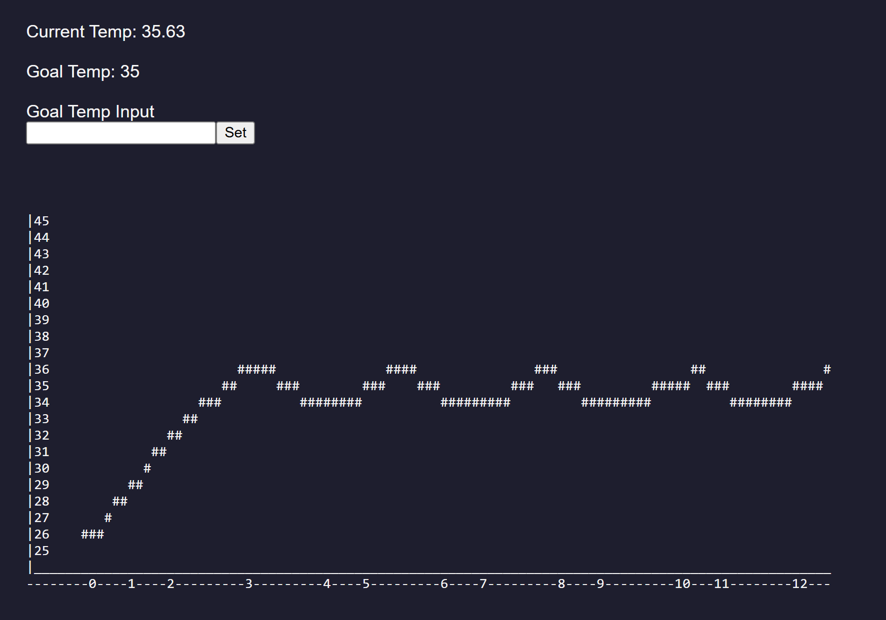

# ESP32 Automated Heating Chamber

An ESP32-based temperature control system that monitors temperature with a **DS18B20 digital temperature sensor**, controls a **12 V heating element and cooling fan**, displays live information on an **OLED screen**, and provides a **Wi-Fi web interface** for remote temperature control and monitoring.



## Features

*  Real-time temperature measurement using a DS18B20
*  Automatic heating control based on a configurable target temperature
*  Cooling fan control
*  128×64 SSD1306 OLED display
*  Wi-Fi connectivity through the ESP32
*  Browser-based control interface
*  Temperature history logging
*  Text-based temperature graph accessible through the web interface
*  Stores up to 5,000 temperature records in memory
*  Records temperature and heater state over time

## Hardware

| Component                | Purpose             | ESP32 Pin |
| ------------------------ | ------------------- | --------: |
| ESP32                    | Main controller     |         — |
| DS18B20                  | Temperature sensor  |    GPIO 2 |
| Heating element / MOSFET | Temperature control |    GPIO 5 |
| Cooling fan / MOSFET     | Cooling             |   GPIO 19 |
| SSD1306 OLED             | Local display       |       I²C |
| 12 V power supply        | Heater/fan power    |         — |

> **Note:** The heater and fan should not be powered directly from ESP32 GPIO pins. A suitable MOSFET or switching module must be used to interface the ESP32 with higher-power loads.

## System Overview

The ESP32 continuously measures the temperature and compares it against the user-defined target temperature.

```text
                 ┌─────────────────┐
                 │     ESP32       │
                 │                 │
                 │ Temperature     │
                 │ Control Logic   │
                 └───────┬─────────┘
                         │
              ┌──────────┼──────────┐
              │          │          │
              ▼          ▼          ▼
         DS18B20       Heater       Fan
        Temperature    Control     Control
          Sensor       GPIO 5     GPIO 19
              │
              │
              ▼
        Temperature Data
              │
        ┌─────┴─────┐
        │           │
        ▼           ▼
    OLED Display  Web Interface
```

## Temperature Control

The system uses a target temperature (`goalTemp`) to determine when heating should be enabled or disabled.

The default target temperature is:

```cpp
int goalTemp = 35;
```

### Heating

When the measured temperature falls more than **0.5°C below the target**, the heater is enabled.

```text
Temperature < Target - 0.5°C
            ↓
        Heater ON
```

### Cooling

When the measured temperature exceeds the target temperature:

```text
Temperature > Target
            ↓
        Heater OFF
        Fan ON
```

The control logic also uses timing intervals to prevent the heater from being switched unnecessarily frequently.

## OLED Display

The SSD1306 OLED displays:

* Current temperature
* Target temperature

Example:

```text
Current Temp
34.72

Goal Temp
35
```

The display uses the Adafruit SSD1306 and Adafruit GFX libraries.

## Wi-Fi Web Interface


The ESP32 connects to a Wi-Fi network and starts an HTTP server on port `80`.

After connecting, the ESP32 prints its local IP address to the Serial Monitor.

```text
WiFi connected!
192.168.x.x
```

The IP address can then be entered into a browser on the same network.

### Web Interface

The web interface displays:

* Current temperature
* Current target temperature
* Temperature input field
* Temperature history graph

The target temperature can be changed directly from the browser.

```text
Current Temp: 34.72

Goal Temp: 35

Goal Temp Input

[  37  ] [Set]
```

## Temperature Logging

Temperature measurements are stored using the following structure:

```cpp
struct TemperatureRecord {
    unsigned long time;
    float temperature;
    bool heaterOn;
};
```

Each record contains:

| Field         | Description                                 |
| ------------- | ------------------------------------------- |
| `time`        | Milliseconds since ESP32 startup            |
| `temperature` | Recorded temperature in °C                  |
| `heaterOn`    | Heater state when the measurement was taken |

The system can store up to:

```cpp
#define RECORDS 5000
```

records.

Measurements are currently recorded approximately every **500 ms**.

## Temperature Graph

The `setGraph()` function converts the recorded temperature data into a text-based graph that can be displayed in the web interface.

For shorter recordings, individual temperature measurements are plotted.

For longer recordings, the data is grouped into approximately **100 sections**, with the temperature values averaged within each section. This allows the graph to represent longer recording periods without requiring thousands of characters.

The graph also includes:

* Temperature scale
* Target-temperature reference
* Time axis
* Temperature history

## Software

### Platform

* **Microcontroller:** ESP32
* **Framework:** Arduino
* **Language:** C++
* **Development Environment:** PlatformIO / Arduino-compatible environment

### Libraries

The project uses:

```cpp
#include <Arduino.h>
#include <OneWire.h>
#include <DallasTemperature.h>
#include <Adafruit_GFX.h>
#include <Adafruit_SSD1306.h>
#include <WiFi.h>
#include <WebServer.h>
```

| Library           | Purpose                        |
| ----------------- | ------------------------------ |
| Arduino           | Core ESP32 functionality       |
| OneWire           | Communication with the DS18B20 |
| DallasTemperature | Temperature sensor interface   |
| Adafruit GFX      | Graphics support               |
| Adafruit SSD1306  | OLED display control           |
| WiFi              | ESP32 wireless networking      |
| WebServer         | HTTP server and web interface  |

## Pin Configuration

The primary GPIO assignments are defined at the beginning of the program:

```cpp
#define ONE_WIRE_BUS 2
#define heatPin 5
#define fanPin 19
```

### GPIO 2 — DS18B20

Digital OneWire communication with the temperature sensor.

### GPIO 5 — Heater

Controls the switching device connected to the heating element.

### GPIO 19 — Fan

Controls the switching device connected to the cooling fan.

## Configuration

The target temperature can be changed in the source code:

```cpp
int goalTemp = 35;
```

The Wi-Fi credentials are also configured in the source:

```cpp
const char* ssid = "YOUR_WIFI_NAME";
const char* password = "YOUR_WIFI_PASSWORD";
```

## Memory Considerations

The temperature history uses a statically allocated array:

```cpp
TemperatureRecord recArray[RECORDS];
```

With 5,000 records, this consumes a significant amount of the ESP32's available RAM.

Increasing `RECORDS` substantially may therefore require optimizing the record structure or using external storage.

## Project Architecture

The program can be divided into four primary systems:

### 1. Sensor System

```text
DS18B20
   ↓
DallasTemperature
   ↓
Temperature Reading
```

### 2. Control System

```text
Temperature
     ↓
Compare with Goal
     ↓
┌────┴────┐
↓         ↓
Heater    Fan
```

### 3. Display System

```text
Temperature + Goal
        ↓
   SSD1306 OLED
```

### 4. Network System

```text
ESP32
  ↓
Wi-Fi
  ↓
HTTP Web Server
  ↓
Web Browser
```

## Future Improvements

Potential improvements to the project include:

* [ ] Add humidity monitoring
* [ ] Add humidity control
* [ ] Add persistent data storage
* [ ] Improve graph scaling and resolution
* [ ] Add heater/fan status to the OLED
* [ ] Add configurable heating and cooling hysteresis
* [ ] Add maximum-temperature safety shutdown
* [ ] Add sensor-disconnection detection
* [ ] Add automatic Wi-Fi reconnection
* [ ] Move Wi-Fi credentials to a secure configuration file
* [ ] Add PWM control for more precise heating
* [ ] Add session-based data logging
* [ ] Add downloadable temperature data
* [ ] Improve the web interface with JavaScript-based live updates

## Safety

This project controls potentially high-power electrical loads. The ESP32 should **not** directly power a high-current heater or fan.

Use appropriately rated:

* MOSFETs or switching modules
* Power supplies
* Wiring
* Connectors
* Fuses
* Heat sinks
* Ground connections

The heating system should also include an independent safety mechanism capable of shutting down the heater if the ESP32, temperature sensor, or control software fails.

## Lessons Learned

It's important to define a specific scope for a project before beginning so a plan can be devised. Not doing this led to delays in this project that could have been avoided. Also a specific deadline could enable realistic goals.

## License

This project is intended for educational and personal engineering development.

If this repository is intended to be reused or modified by others, add an appropriate open-source license such as MIT before publishing.
